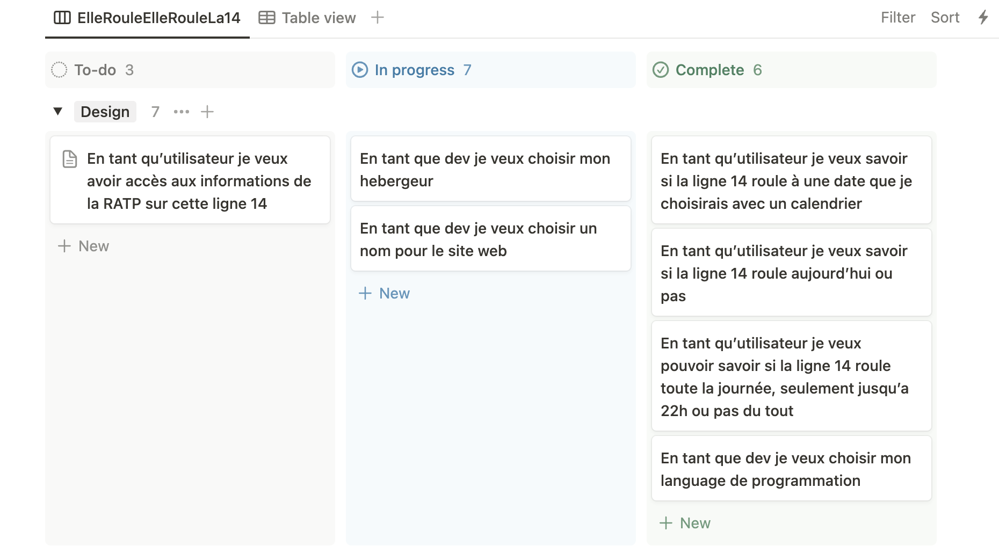

# Elle-Roule-la-14
Un page web permettant de savoir si la ligne 14 est ouverte, au jour J et à une date demandée par la suite. 

# L'idée
Ces derniers mois et plus encore pour les mois à venir la ligne 14 va etre souvent fermée ou à l'arret plus tôt, j'ai eu l'idée d'avoir cette petite page que je peux regarder directement pour savoir quel est le statut de la ligne de façon dynamique mais assez simple. 

# La reflexion 
J'ai essayé de construire le projet avec un petit kanban et quelques US pour les users et coté développement, ça permet de savoir ou on en est et d'avoir une belle vision d'ensemble. 
 

# La création
Plusieurs étapes dans la création à proprement parler : 
      - Recuperer les données des jours d'ouverture (un peu fastidieux, à la main et il y a surement un moyen plus rapide à voir pour la suite)
      - Crée quelques petites fonctions en JS pour afficher l'etat de la ligne selon le jour (un peu d'aide de chatGPT pour aller plus vite) 
      - Ajuster le CSS pour avoir le code couleur de la 14 tout en gardant une page ultra-simple 
      - Choisir un endroit pour deployer le tout (au plus simple avec github page) 

# Conclusion 
Un petit projet simple surtout fait pour aller "au bout d'une idée" mais aussi qui reflete bien ma vision du code et plus généralement du numerique, un outil au service des utilisateurs pour aller au plus simple donc au plus efficace. 
